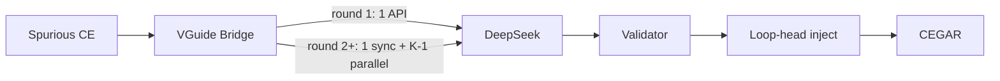

# VGuide 進度報告（2026-06-04）

**日期**: 2026-06-04  
**報告人**: r14k41044 黃思維  
**專案**: CPAchecker Unified VGuide（LLM 引導 Predicate CEGAR）

---

## 1. 執行摘要（30 秒版）

| 項目 | 狀態 |
|------|------|
| **Unified VGuide（全 Java）** | 已接入 PredicateCPA，可 batch |
| **LLM 多抽卡** | **程式已實作**；**實驗尚未執行**（目前 batch 皆 `K=1`） |
| **Benchmark** | 官方 sparse `~/sv-benchmarks`，`full_scalar` **217 題** |
| **實驗** | **`tier_s_15s` `full_scalar` 217/217 完成**（`K=1`，見 §4.5–§4.6）；tier40 **118 題**（封存） |
| **主要發現** | vs **stock**（217）：verdict **11↑/205=/1↓**；**PAR-2 259 vs 283**（VGuide 較低）；多解 **10 題**但同解出題 **stock 常較快**（§4.4.2）；**1 ERROR**（`watermelon`） |
| **後續改進** | §8：prompt／離線 L3／ensemble／NO_SPURIOUS（**不要求** LLM 產 Craig） |

---

## 2. 本階段完成的工作

### 2.1 實作（Unified VGuide）

- **套件**: `src/.../cpa/predicate/vguide/` — Bridge、DeepSeek client、Prompt、Validator、Loop-head 注入、排程。
- **LLM 排程**: `tier_s_15s`（`min_interval=15s`，`every_n=72`）；`maxLlmRounds` = **spurious 輪數**上限（每輪內可多次 HTTP，仍只計 1 輪）。
- **LLM 多抽卡（新，僅程式）**: 見 [`LLM_ENSEMBLE.md`](LLM_ENSEMBLE.md)
  - **Spurious #1**：**恆 1 次**同步 API，**不平行**（DeepSeek prompt cache + 試水溫）。
  - **Spurious #2+**：`llmSamplesPerCall=K` 時 → **1 同步 + (K−1) 平行**；合併去重後進 Validator。
  - **實驗狀態**：`config/vguide.properties` 預設 **`llmSamplesPerCall=1`**；已跑完的 sample / tier40 / tier_s_15s **都未開 K>1**，故 **多抽卡效果尚無實驗數據**。
- **Soundness**：謂詞只進 precision；TRUE/FALSE 仍由 MathSAT + CEGAR 決定。

### 2.2 實驗基礎建設

| 元件 | 說明 |
|------|------|
| `run.sh` / `run_benchmark_set.sh` | 單一入口；**邊跑邊寫 CSV** |
| `compare_official_reference.py` | Verdict 桶對照（TRUE/FALSE/INCOMPLETE） |
| `analyze_benchmark_comparison.py` | **PAR-2**、牆鐘、cactus；`post_batch_analysis.sh` 一次跑齊 |
| `LLM_ENSEMBLE.md` | 多抽卡行為、`maxLlmRounds` 語意、合併說明 |

### 2.3 Benchmark

- **`full_scalar`**：**專案 manifest**（`RUN_SCALAR` 217 題），**不是** SV-COMP 表上的 category；來源為 **ReachSafety-Loops 相關**之 `sv-benchmarks` `c/loop*`、`c/loops*` 子樹，**≠** Loops 全量 774 題（對照分數見 §4.4）。
- `full_scalar` **217/217** 可解析；11 題 FMPA2-only 已排除、不補檔。
- **`full_array_scalar`**：另 **8 題**（`RUN_ARRAY_SCALAR`，如 heapsort），不併入 `full_scalar`。

---

## 3. 系統架構（簡圖）



---

## 3.5 LLM 提案：Prompt、Harness、Craig 與通過率

### 3.5.1 LLM 是否「有意識」要符合 Craig？

**沒有。** 現行 prompt（`ProposalPromptBuilder`）只要求 LLM 扮演 **CEGAR predicate abstraction** 的助手，產出 **候選抽象謂詞**（SMT-LIB2、JSON），並未提及：

- Craig / 插值公式
- 反例 trace 分段（A、T、C）
- 「必須成為合法 interpolant」或任何與 MathSAT 插值管線對齊的語意

**Craig 仍由 CPAchecker 既有流程負責**：`PredicateCPARefiner` → `InterpolationManager` 在 spurious path 上計算插值。Unified VGuide 在 **該輪 refinement 之前** 呼叫 LLM，驗證通過的謂詞用於：

1. **PRECISION_ONLY** → `LoopHeadPrecisionInjector` 注入局部精度（下一輪探索用）  
2. **ENTAILED**（相對 loop-head **block formula** 被蘊含）→ 可選 **AND 進既有 interpolant**（`strengthenInterpolants`），**不是**用 Craig 條件去驗證 LLM 輸出

因此：**LLM 生成時不會、也不需要「符合 Craig 生成」**；我們的檢驗是 **L1 合約 + L2 解析 + L3 block entailment**（`PredicateValidationPipeline`），與 Craig 合法性是不同層次的性質。

### 3.5.2 現行 Prompt 結構（Java 主路徑）

實作：`src/.../vguide/ProposalPromptBuilder.java`。組成如下：

| 區塊 | 內容 |
|------|------|
| 角色 | 「CEGAR-based predicate abstraction verifier」；產出 SMT-LIB2 候選謂詞 |
| 目標 | `Target assertion:`（從 `__VERIFIER_assert(...)` 抽出） |
| Loop heads | `LoopHeadIndex.formatForPrompt()`（注入點標籤；**不要求** LLM 綁 N* 節點） |
| 變數合約 | `VarContractBuilder` + `SourceVariableHints`（允許的 scalar 名、陣列題禁止 `A[i]`） |
| **RULES** | 僅用合約變數名；SMT 前綴；偏好 `bvsge`/`bvslt` 等；禁止 `\|main::\|`、`@`、`.def_`、`select`/`store`、C 陣列下標；建議 **4–8** 個謂詞 |
| 任務範例 | 依原始碼型態附加 scalar / array-index / multi-index 範例 |
| 原始碼 | 完整 `.i` 來源 |
| 首輪 / 後續 | **#1**：強調 first spurious、loop-carried 關係；**#2+**：附加 `traceSummary`（前 5 個 block formula 摘要） |
| 輸出格式 | **僅 JSON**：`{"predicates": ["(bvsge i (_ bv0 32))", ...]}` |
| Repair（例外） | 若 parse 後 **L1 全空**，再以 `buildRepair` 列出 **REJECTED** 字串重問 **1** 次 |

RULES 中「violations are discarded automatically」指的是 **Java 端 L1/L2/L3**，不是 Craig。

### 3.5.3 Harness 包含什麼？

#### A. 執行期（CPAchecker 內，Unified VGuide）

| 步驟 | 元件 | 說明 |
|------|------|------|
| 觸發 | `VGuideRefinementBridge.onSpuriousBeforeRefinement` | 排程通過（`LlmCallScheduler`）且 spurious 已有 interpolants |
| 上下文 | `ContextPackBuilder` → `ContextPack` | 原始碼、assertion、loop heads、**varContract**、trace 上 **encodedVars**、**BlockFormulas**、既有 **interpolants**、trace 摘要 |
| API | `PredicateProposalClient` | DeepSeek `chat/completions`；`DEEPSEEK_API_KEY`；temperature=0 |
| 解析 | `LlmResponseParser` + `LlmProposalSanitizer` | JSON 抽取；L1 違規進 `rejected`；最多 12 條 |
| 驗證 | `PredicateValidationPipeline` | **L1** `PredicateContractValidator`；**L2** `VocabularyGuide.parsePredicate`；**L3** 每 loop head：`block ⊨ pred` → ENTAILED，否則 PRECISION_ONLY |
| 套用 | `strengthenInterpolants`（ENTAILED）+ `LoopHeadPrecisionInjector`（PRECISION_ONLY） | Soundness：只加精度／加強插值，不改 TRUE/FALSE 判定邏輯 |
| 產物 | `output/.../vguide_artifacts/` | 每輪 raw LLM + 驗證結果（可離線重放） |

多抽卡（`llmSamplesPerCall>1`）時：`LlmEnsembleMerger` 合併多份 JSON 後走同一 validator（實驗尚未跑，見 §5）。

#### B. 離線品質 Harness（不跑 CPA）

腳本：`scripts/vguided-cegar/test_llm_proposal_quality.py`  
文件：[`LLM_QUALITY_SAMPLE.md`](LLM_QUALITY_SAMPLE.md)

- Prompt 與 Java **RULES / JSON 格式 / task examples** 對齊（離線省略 loop-head 細節）
- 每題預設 **5** 次 API（可平行）；檢查 **JSON 可解析** + **L1 合約**（與 `PredicateContractValidator` 同規則）
- **不跑 L2/L3 SMT**（無 block formula）

### 3.5.4 通過率（截至報告撰寫時）

須區分三種「通過」：

| 層級 | 定義 | 觀測 |
|------|------|------|
| **離線 L1** | JSON + 合約（無 SMT） | 4 題 × 5 次：**json 5/5**；合約 **146/146（100%）**（`up`/`down`/`array_3-1`/`string_concat-noarr`） |
| **CPA：進入 validator 並出 log** | 通過 L1+L2，至少一個 loop head 完成 L3 分類 | sample / tier40 / interval15 的 INFO log **幾乎無** `reject L1/L2`（該訊息在 **FINE**，預設不可見）；有 LLM 的題目多數每輪 4–8 條 `VGuide predicate` |
| **CPA：L3 為 ENTAILED** | `block ⊨ pred`，可 strengthen interpolant | 各 batch 的 **loop-head 標籤** 中 ENTAILED 約 **26%–42%**（其餘 PRECISION_ONLY 仍注入精度） |

**執行 log 彙總**（`VGuide predicate` 行數 ≈ 通過 L1+L2 並完成分類的謂詞條數；ENTAILED/PRECISION_ONLY 為 **per loop head** 標籤，一行可多個）：

| 批次 | 有 log 題數 | LLM 輪次 | predicate 行 | ENTAILED 標籤 | PRECISION_ONLY 標籤 | ENTAILED 佔標籤比 |
|------|------------|----------|--------------|---------------|---------------------|-------------------|
| sample_vguide | 8 | 10 | 71 | 37 | 105 | **26.1%** |
| tier40（封存） | 118 | 119 | 754 | 392 | 636 | **38.1%** |
| tier_s_15s（進行中，92 題） | 92 | — | — | — | — | **43.2%** |

**解讀（向 advisor）**：

1. **Prompt 沒教 Craig**；通過率高的是 **格式／變數合約** 與 **能否當 precision**，不是「已是 Craig 插值」。  
2. **離線 100% L1** 不代表證明力強；CPA 內約 **六成標籤為 PRECISION_ONLY**（仍可能有幫助，但不直接 strengthen Craig）。  
3. **Repair 路徑** 僅在 ensemble/parse 後 **accepted 為空** 時觸發，tier40 sample 中少見。

### 3.5.5 與後續改進的銜接

§8 列出可執行的改進路線；其中 **Prompt／驗證／Harness** 三項直接對應本節觀察（Craig 未進 prompt、ENTAILED 比例有限、離線未跑 L3）。

---

## 4. 實驗結果

### 4.1 Tier S Sample（8 題，300s）

| 題目 | VGuide | VGuide ref | Stock ref | 備註 |
|------|--------|------------|-----------|------|
| up / down / string_concat | analysis（≈timeout） | 47 / 50 / 222 | 65 / 99 / 229 | **ref↓，仍未 TRUE** |
| array_3-2 / array_4 | analysis | 69 / 117 | 130 / 130 | ref↓ |
| array_3-1 / large_const | 快速 TRUE | 2 / 3 | 4 / 6 | |
| **heapsort** | **TRUE ~119s** | **9** | **10**（stock 亦 **TRUE ~106s**） | **1 次 LLM**；**非「靠 LLM 才解」**（見 §4.2） |

**Sample 結論**: 8/8 題 refinement ≤ stock；heapsort 對外 case study 強調 **proxy 不穩定 → 我們穩定 TRUE**，不宜宣稱 LLM 為本地必要條件。

### 4.2 Case study：`heapsort`

詳見 [`case_studies/heapsort.md`](case_studies/heapsort.md)（含 **§8 Stock log 對照**）。

#### 三種 baseline 各代表什麼

| 設定 | 結果 | Ref | 敘事角色 |
|------|------|-----|----------|
| **FMPA2 官方 proxy** @300s | 常 **TIMEOUT**（偶有 ~212s TRUE，不穩） | — | **對外 rescue** 對照 |
| **VGuide**（sample） | **TRUE ~119.4s** | **9** | LLM 第 1 次 spurious：8 條區間謂詞 + **12** 條 loop-head 注入 |
| **Stock**（同機、關 VGuide） | **TRUE ~106.3s** | **10** | 證明 **本地非 LLM 亦可解**，且此次 **更快** |

#### Stock vs VGuide log 差異（同題、同 `predicateAnalysis-vguide`）

| 指標 | VGuide | Stock |
|------|--------|-------|
| 第一次 spurious 後 | LLM 8 謂詞 → strengthen **1** interpolant → inject **12** local | 僅 Craig **2** 謂詞進 refinement #1 |
| Refinement 軌跡（每輪 itp 數） | 2→2→2→2→4→6→8→8→10（**9** 輪） | 2→2→2→4→4→4→6→8→**2→2**（**10** 輪） |
| 發現 predicates 總數 | **59** | **46** |
| 抽象 post 次數 | **646** | **924** |
| CEGAR refinement 牆鐘 | ~**2.0s** | ~**0.4s** |
| 總牆鐘 | **119.4s** | **106.3s** |

**解讀（向 advisor）**：

1. **不能說**「多了 LLM 才解出 heapsort」——stock 同設定已 **TRUE**。  
2. **可以說** LLM 在第一次 spurious 就給出與 `assert(1≤…≤n)` 同族的 **區間精度**，省掉 stock 尾端兩輪 `predicates=2` 的 refinement，並改變精度累積路徑（#2–#4 維持 2 條 itp 等）。  
3. 此次 VGuide **總時間略慢**（抽象更厚：max **47** vs **37** preds/location），trade-off 是 **ref 次數↓** 與 **對 proxy 的穩定性**，不是 sample 上加速。  
4. Case study 主軸仍是 **官方 proxy TIMEOUT/不穩 → 我們穩定 ~119s TRUE**。

### 4.3 `full_scalar` tier40（118/217，封存）

TRUE 45 / FALSE 21 / UNKNOWN 52；排程 40s interval，多為 ~1 LLM/題。

### 4.4 對照 baseline：同設定 stock（無 LLM）

**主對照**為本機重跑的 **stock PredicateCPA**：與 VGuide **完全相同** 的 CPA 設定，只差 `useVocabularyGuide=false`（不呼叫 LLM）。

| | **Stock baseline** | **VGuide** |
|--|-------------------|------------|
| 設定檔 | `config/predicateAnalysis-vguide.properties`（含 `vguide.properties` 排程項，但 bridge 不啟用） | 同上 |
| 開關 | `--mode stock` → `useVocabularyGuide=false` | `useVocabularyGuide=true` + DeepSeek |
| 時限／heap | **300s**、`2000M`（`run_benchmark_set.sh`） | 相同 |
| Benchmark | `~/sv-benchmarks/c`，`full_scalar` **217 題** | 相同 |
| 輸出 | `output/vguide/experiments/full_scalar_stock_interval15/` | `.../full_scalar_vguide_interval15/` |

```bash
# Baseline（不需 DEEPSEEK_API_KEY）
./scripts/vguided-cegar/run.sh cpa --set full_scalar --mode stock --parallel 8 --timelimit 300 \
  --out output/vguide/experiments/full_scalar_stock_interval15

# 對照 + PAR-2 + cactus（VGuide 與 stock 皆跑完後；**每次 batch 必跑**）
./scripts/vguided-cegar/post_batch_analysis.sh \
  --vguide-out output/vguide/experiments/full_scalar_vguide_interval15 \
  --stock-out  output/vguide/experiments/full_scalar_stock_interval15 \
  --set full_scalar --timelimit 300
```

產物：`vs_stock_baseline.txt`、`analysis_vs_stock.txt`、`cactus_vs_stock.png`。

**可比題數**：**217/217**（兩邊皆有 log）。**持平** = verdict **桶相同**（TRUE/FALSE/INCOMPLETE），**不等於**牆鐘相同。

#### 4.4.2 Verdict、PAR-2、cactus（217 題，2026-06-05 stock 重跑）

| 指標 | Stock | VGuide |
|------|-------|--------|
| 解出（TRUE+FALSE） | **116** | **126** |
| TRUE / FALSE / 其餘 | 76 / 40 / 101 INCOMPLETE | 87 / 39 / 91（+1 ERROR） |
| **PAR-2 平均**（300s，未解罰 600s） | **283.4 s** | **258.8 s** |
| 解出題牆鐘中位數 | **0.98 s** | **2.47 s** |

**Verdict 桶**：**11 變好**、**205 持平**、**1 變差**（`benchmark40_polynomial`：FALSE→UNKNOWN）。

**PAR-2 解讀**：VGuide **整體較低**（較好）主因 **多證出 10 題**（少付 600s 罰分）；逐題 PAR-2 仍 **stock 較低 102 題**、VGuide 較低 25 題。兩邊**同解出且同 verdict**（115 題）：**stock 較快 101**、VGuide 較快 14；中位時間比 VGuide/stock ≈ **2.2×**。

**Cactus**：`cactus_vs_stock.png` — VGuide 曲線在長時間端較高（覆蓋更多題），短時間端接近。

**向 advisor**：價值在 **覆蓋率／PAR-2**，不是全面加速；與 heapsort case study（stock 較快但同解）一致。

#### 4.4.1 Legacy：FMPA2 proxy（**不再**作主對照）

先前用的 **FMPA2** `predicate-abstraction` @300s（CPAchecker **4.2.2**、不同機器／版本）僅作歷史參考；與 VGuide **設定不一致**，**不得**與 stock 數字混談。若需重現舊表：

```bash
python3 scripts/vguided-cegar/compare_official_reference.py --baseline fmpa2 \
  --vguide-logs output/vguide/experiments/full_scalar_vguide_interval15/logs \
  --manifest docs/vguided-cegar/benchmark_sets/full_scalar.list
```

（舊結果約 180 題可比、59↑/5↓ — **已過時**，僅封存對照。）

參考：SV-COMP 2025 ReachSafety-Loops 類 CPAchecker 得分 **922**（774 題）；我們為 217 題子集。

### 4.5 完成：`tier_s_15s` `full_scalar`（217/217，2026-06-04）

| 項目 | 數值 |
|------|------|
| 設定 | `min_interval=15s`，`every_n=72`，`maxLlmRounds=5`；**`llmSamplesPerCall=1`** |
| 結果 | TRUE **87**, FALSE **39**, UNKNOWN **90**, **ERROR 1** |
| 有 LLM 輪次 | **113** 題（共 **145** 次 API 輪）；TRUE 87 題中 **40** 題曾觸發 LLM |
| 標籤（log 累計） | ENTAILED **725** / PRECISION_ONLY **884**（約 **45%** ENTAILED） |
| 快速 UNKNOWN | **10** 題 `note=fast_unknown`（`refinements=0`，非 300s 卡死） |
| 彙總 | `output/vguide/experiments/full_scalar_vguide_interval15/full_scalar_summary.csv`（`rebuild_summary_csv.py` 自 log 重建） |

#### 4.5.1 備註：`watermelon`（不計入方法成效）

`loops-crafted-1/watermelon.c` 含全域變數名 **`int true` / `int false`**。VGuide 首輪 LLM 成功後，PredicateCPA 將插值原子化時 `uninstantiate` 還原成 SMT 變數名 **`false`**，觸發 `IllegalArgumentException`（SMT-LIB2 保留字）。屬 **CPAchecker × benchmark 命名** 的 infrastructure crash，**非** VGuide soundness 或 LLM 品質問題；主表統計時視為 **ERROR／排除**，不與 TRUE/FALSE/UNKNOWN 方法比較。

### 4.6 做法有沒有用？（成效解讀）

**結論（向 advisor）**：**有用，但角色要講對**——看 **PAR-2 + 解出題數 + cactus**，不是只看 verdict「持平」或單題加速。

| 維度 | 觀察 | 解讀 |
|------|------|------|
| **公平 ablation** | vs **同設定 stock**（§4.4） | 只差 LLM／VGuide bridge |
| **Verdict** | 11↑ / 205= / 1↓ | 「持平」= **桶相同**；11 題 stock UNKNOWN→VGuide TRUE |
| **PAR-2** | **258.8** vs **283.4**（VGuide 較低） | **整體較好**；因多解 10 題，非單題普遍更快 |
| **牆鐘** | 同解出 115 題：stock 快 **101** | LLM 常加厚抽象；**heapsort** 同型（§4.2） |
| **LLM** | 113/217 有 API；40/87 TRUE 曾觸發 LLM | 多數 TRUE 仍靠 CEGAR；LLM 改 **能否證出** |
| **硬題** | up 等仍 UNKNOWN | CEGAR 仍不足；見 §8 |
| **邊界** | 1 ERROR（watermelon） | infrastructure 備註 |

**一句話**：在 217 題上 VGuide **多證出 10 題、PAR-2 降 ~25s**；論文應同時報 **verdict + PAR-2 + cactus**，並誠實寫 **同解出題 stock 常較快**。

**下次實驗必做**：`post_batch_analysis.sh`（[RUN_EXPERIMENTS.md §6.2](RUN_EXPERIMENTS.md#62-批次後分析每次-vguide--stock-跑完都要做)）。

---

## 5. LLM 多抽卡：已實作、**尚未做實驗**

| 項目 | 狀態 |
|------|------|
| 程式 | ✅ `VGuideRefinementBridge` + `PredicateProposalClient.proposeParallelExtras` |
| 文件 | ✅ [`LLM_ENSEMBLE.md`](LLM_ENSEMBLE.md) |
| **已跑 batch** | ❌ 皆為 **`llmSamplesPerCall=1`**（與改版前相同） |
| 計畫實驗 | 全量跑完後，對 **up / down / string_concat** 等加 `K=3` 對照 |

**設計要點（向老師一句話）**  
第一輪 spurious **固定 1 次 API、不平行**（cache）；第 2 輪起才可 K 抽。多 draw 語意不一致 **只可能變慢，不影響 soundness**。

未來啟用（**尚未執行**）：

```bash
--option vguide.llmSamplesPerCall=3 --option vguide.llmSampleParallelism=3
```

---

## 6. 為何 baseline 會出現「300s、0 次 refinement」？

這是向老師說明 **舊 rescue 動機** 與 **現有 Unified 路徑** 的關鍵；須與「幾秒內 FALSE、0 ref」區分。

### 6.1 名詞（見 [`NO_SPURIOUS_STATISTICS.md`](NO_SPURIOUS_STATISTICS.md)）

| 術語 | 定義 |
|------|------|
| **NO_SPURIOUS**（舊稱 ZERO_CONTEXT_TIMEOUT） | 時限內 **0 次 predicate refinement** → **從未進入**「spurious CE → 加謂詞」的 CEGAR 迴圈 |
| **FIRST_SPURIOUS_OK** | ≥1 次 refinement → Unified VGuide **主路徑**可叫 LLM |
| **FROZEN_SEED（Exception）** | NO_SPURIOUS 時不 call API，改讀 `predicate_sets/<case>.json` 預錄謂詞再注入 |

**重要**：VGuide 設計是 **等第一條 spurious 才 LLM**。若 300s 內 **連第一次 spurious 都沒有**，則 **LLM 完全不會被呼叫**（不是 API 失敗）。

### 6.2 為什麼 PredicateCPA 會「跑滿 300s 卻 0 refinement」？

```text
Predicate 抽象探索狀態空間
  → 抽象太粗 / 探索太慢 / 狀態爆炸
  → 在時限內從未產生「可觸發 refinement 的 spurious counterexample」
  → Number of predicate refinements = 0
  → TIMEOUT（UNKNOWN）
```

常見於 **loop 關係複雜、初始精度幾乎為空** 的題（例如舊池的 `up`、`down`、`string_concat-noarr` 在 **官方 Predicate @300s** 診斷下）。

**Legacy 診斷池（20 題，非現行 217 主評估集）**：

| 指標 | 結果 |
|------|------|
| 設定 | SV-COMP loop 子集、300s、**無** bootstrap、**無** LLM |
| NO_SPURIOUS（0 ref） | **20 / 20（100%）** |
| 任務例 | `up`, `down`, `string_concat-noarr`, `seq-3`, `half_2`, … |

這也是早期做 **bootstrap 注入初始精度** 的原因；Unified VGuide 改為 **第一次 spurious 才 LLM**，對仍為 NO_SPURIOUS 的題需靠 **Frozen exception** 或另開初始精度策略。

### 6.3 與「0 ref 但幾秒就結束」的差別（易混淆）

在 **tier40 已跑 log** 中，**5 題** `refinements=0`，但 **不是** 300s 失敗：

| 題目 | 結果 | 牆鐘 | 原因 |
|------|------|------|------|
| `benchmark28_linear` 等 | **FALSE** | **<3s** | 抽象直接到達 **違規狀態**（`target states: 1`），**不需 CEGAR refinement** |
| （無） | UNKNOWN + 0 ref | 300s | tier40 **沒有** 此類；51 題為 timeout 且 **refs>0** |

向老師說：**「0 refinement」要分兩類——快速找到 bug（FALSE）vs 探索卡住（NO_SPURIOUS timeout）。**

### 6.4 官方 proxy（FMPA2）與我們 VGuide 實測的對照

| 題 | 官方 proxy（pred @300s） | 我們 VGuide sample（同題 300s） |
|----|------------------------|-------------------------------|
| **up** | **TIMEOUT ~301s**（BenchExec；舊診斷屬 zero-context 池） | **UNKNOWN ~291s**，**47 refinements**，**1 次 LLM** |
| **heapsort** | 常 TIMEOUT / 不穩 | **TRUE ~119s**，9 ref，1 次 LLM（**stock 亦 TRUE ~106s**，§4.2） |

解讀：

1. **官方 baseline 的 up**：在競賽型 Predicate 設定下常 **整題 timeout 且無 refinement 上下文** → 舊稱 zero-context。  
2. **我們的 up**：已有 spurious → **有 refinement、有 LLM**，但仍 **證不出 TRUE** → 問題變成 **CEGAR 仍不足**，不是「完全沒 context」。  
3. 論文表述：主方法評估應標 **FIRST_SPURIOUS_OK** 題；NO_SPURIOUS 題用 **Exception / frozen** 或獨立 bootstrap 對照（見 `NO_SPURIOUS_STATISTICS.md`）。

### 6.5 Unified 路徑遇到 NO_SPURIOUS 時怎麼辦？

```text
分析結束且 refinements == 0
  → VGuideOutcome: NO_SPURIOUS_GIVE_UP（不 call LLM）
  → 若存在 predicate_sets/<benchmark>.json
       → FROZEN_SEED：注入預錄謂詞後由 CPA 再證（無 API）
```

`full_scalar` 217 題 **主評估** 不含 Legacy 20 池全體；`half_2`、`seq-3` 等 frozen 題在 manifest 有另列。

---

## 7. 已知限制（建議主動講）

1. 217 題 ≠ 全 SV-COMP Loops；不宣稱打贏 922 分。  
2. 主對照為 **同設定 stock batch**（§4.4）；FMPA2 proxy 僅 legacy（§4.4.1）。  
3. **up/down 仍 timeout**（ref 有降）。  
4. **5 題 degraded** 待查 log（與 tier40 相同 5 題）。  
5. **`full_array_scalar`（8 題）尚未跑**；ensemble `K>1` 尚未跑。  
6. **`watermelon`**：benchmark 變數名與 SMT 保留字衝突 → ERROR（§4.5.1），不計方法失敗。

---

## 8. 未來改進方向

以下依 **可落地性** 與 **與現況差距** 排列；不要求 LLM 產出「合法 Craig 公式」（成本高、易過度約束），而是提高 **對當前 spurious trace 有用** 的謂詞比例與 **可量測** 的品質。

### 8.1 Prompt 與上下文（短期，低成本）

| 方向 | 現況 | 建議 |
|------|------|------|
| **插值語意（軟引導）** | 未提 Craig | 在 prompt 用 **白話** 說明：候選謂詞應在 **當前反例路徑上為真**、有助 **切分相似 spurious**；可附 **1–2 條** 已算出的 interpolant 摘要（human-readable dump），**不**要求 LLM 輸出 interpolant |
| **Trace 上下文** | 後續輪僅前 5 個 block 文字摘要 | 結構化 **loop guard / 關係變數**、最後一次 spurious 的 **關鍵分支**；陣列題強調 **index scalar** 模板 |
| **ENTAILED 導向** | 規則只寫「4–8  diverse」 | 明示「優先提出在給定路徑區段上 **明顯為真** 的邊界（如 `i≥0`, `i<n`）」；與 L3 標籤對齊，提高 strengthen 命中率 |
| **Repair 擴充** | 僅 L1 全空才 repair | L2 parse 失敗或 **本輪 0 條 ENTAILED** 時也觸發 repair，並回傳 **拒絕原因碼**（`internal_pipe`, `c_array_subscript` 等） |
| **Prompt 版本化** | 隱式 v2 + sanitizer | `vguide.promptVersion` 寫入 artifact，方便 A/B 與論文附錄 |

### 8.2 驗證與 Harness（中期）

| 方向 | 建議 | 預期效益 |
|------|------|----------|
| **離線 L2/L3** | `test_llm_proposal_quality.py` 對固定 **golden trace**（或從 log 抽 `ContextPack`）跑 **parse + block entailment** | 會議前即可預測 ENTAILED 比例，不必等 217 題 CPA |
| **可觀測性** | INFO 彙總：`L1_reject` / `L2_reject` / `entailed` / `precision_only` **每輪計數** | 回答「通過率」不需挖 FINE log |
| **注入策略** | 可選 **只注入 ENTAILED**，或 PRECISION_ONLY **上限 N**、按 SMT 成本排序 | 減少無效精度導致狀態爆炸（緩解 up/string 類 timeout） |
| **弱 Craig 檢查（研究向）** | 對 ENTAILED 候選再驗 `A∧T ⊨ pred` 於插值點（需接 `CounterexampleTraceInfo` 分段） | 過濾「路徑上真但非插值性質」的謂詞；**非** soundness 必要條件 |
| **離線 ↔ 線上對齊** | 從 `vguide_artifacts/` 重放 validator | 除錯 degraded / 單題 regression |

### 8.3 CEGAR 路徑與實驗（與 P0–P3 對齊）

| 優先 | 改進 | 說明 |
|------|------|------|
| **P0** | ~~跑完 **tier_s_15s**~~（**217/217 已完成**）+ `full_array_scalar` | 建立完整 217+8 基線後再改 prompt，避免混因 |
| **P1** | **Ensemble `K=3`**（§5） | 提高每輪 **unique 有效謂詞** 數；量測 ref↓ / TRUE↑ vs K=1 |
| **P1** | **排程掃描** | `every_n` × `min_interval` 小網格（成本 vs LLM 覆蓋率） |
| **P2** | **NO_SPURIOUS 策略** | 第一輪 spurious 前 **輕量 bootstrap**（模板邊界）或擴大 **frozen** 覆蓋；與「僅 first-spurious LLM」對照寫清 |
| **P2** | **5 題 degraded 根因** | 是否 LLM 謂詞干擾抽象、或排程過密；必要時關閉該題 LLM 做 ablation |
| **P3** | **up / down / string_concat** 專案子集 | 論文主戰場：ref 已降但仍 timeout → 目標是 **TRUE 或大幅降 ref** |

### 8.4 評估與論文（長期）

- **分層報告**：`FIRST_SPURIOUS_OK` vs `NO_SPURIOUS` 分開統計；避免把「從未 call LLM」與「call 了仍失敗」混在同一張表。  
- **品質指標**：除結果（TRUE/FALSE/TIMEOUT）外，固定報 **LLM 輪數、ENTAILED 率、precision 注入數、strengthen 次數**。  
- **對照完整性**：217 題全量 + 官方 proxy；必要時補 **Zenodo 官方 XML** 子集做 sanity check。  
- **成本模型**：API 次數 × latency vs 節省的 refinement 時間（heapsort 類正向案例可算 ROI）。

### 8.5 不建議或延後

- **要求 LLM 直接輸出 Craig 插值**：格式與 MathSAT 內部表示難對齊，且 soundness 仍須由求解器保證。  
- **以 Craig 合法性作為 LLM 硬門檻**：易把提案空間砍過窄；現行 **block entailment + CPA 插值** 已足夠 sound。  
- **未跑完基線就大改 prompt**：先固定 **K=1 全量**，再疊 prompt v3 / ensemble。

---

## 9. 建議話術（會議版）

1. **工程**：Unified Java VGuide + batch + 官方 proxy 對照。  
2. **證據**：vs stock — **11 題 verdict 變好、PAR-2 259 vs 283**；cactus 覆蓋↑、同解出題 stock 常較快（§4.4.2）。  
3. **多抽卡**：**已寫進程式，實驗還沒跑**（目前全是 K=1）。  
4. **Zero-context**：官方 **up** 類題常 **300s、0 ref**；我們 **up** 已有 **47 ref + LLM** 但仍 timeout——兩種瓶頸要分開講。  
5. **LLM 品質**：**不**要求符合 Craig；檢驗為 L1/L2/L3；離線合約 ~100%，執行時多數提案進 precision，**ENTAILED 約 26–42%**（見 §3.5）。  
6. **路線圖**：短期補 prompt/trace 與 ENTAILED 導向；中期離線 L3 + 注入策略；實驗先 ensemble 與 NO_SPURIOUS（§8）。  
7. **誠實**：5 題 degraded；**217/217 已完成**；`watermelon` 為工具 crash 備註。

---

## 10. 下一步

| 優先 | 工作 |
|------|------|
| P0 | 跑 `full_array_scalar`（8）；查 **5 degraded** |
| P1 | 簡報／論文表：§4.5–§4.6 數字；必要時 Zenodo XML 子集 sanity check |
| P2 | **首次 ensemble 實驗**（`llmSamplesPerCall=3`，不穩定題子集） |
| P3 | 查 5 題 degraded；NO_SPURIOUS 題 frozen 對照 |
| P4 | Prompt v3 + 離線 L2/L3 harness（§8.1–8.2） |

*詳細改進項見 **§8**；上表為近期可執行排程。*

---

## 11. 附錄路徑

| 文件 | 路徑 |
|------|------|
| 本報告 | `docs/vguided-cegar/2026-06-04-vguided-cegar-report.md` |
| **Advisor 簡報 PDF** | `docs/vguided-cegar/2026-06-04-vguided-cegar-slide/slides.pdf`（講者稿：`slides_presenter.pdf`） |
| heapsort | `docs/vguided-cegar/case_studies/heapsort.md` |
| 多抽卡 | `docs/vguided-cegar/LLM_ENSEMBLE.md` |
| NO_SPURIOUS / 0 ref | `docs/vguided-cegar/NO_SPURIOUS_STATISTICS.md` |
| LLM 離線品質 | `docs/vguided-cegar/LLM_QUALITY_SAMPLE.md` |
| Prompt 原始碼 | `src/.../vguide/ProposalPromptBuilder.java` |
| 實驗輸出 | `output/vguide/experiments/` |
| vs stock 分析 | `analysis_vs_stock.txt`、`cactus_vs_stock.png`、`post_batch_analysis.sh` |

```bash
# 會議前更新進度
wc -l output/vguide/experiments/full_scalar_vguide_interval15/full_scalar_summary.csv
```

---

*r14k41044 黃思維*
