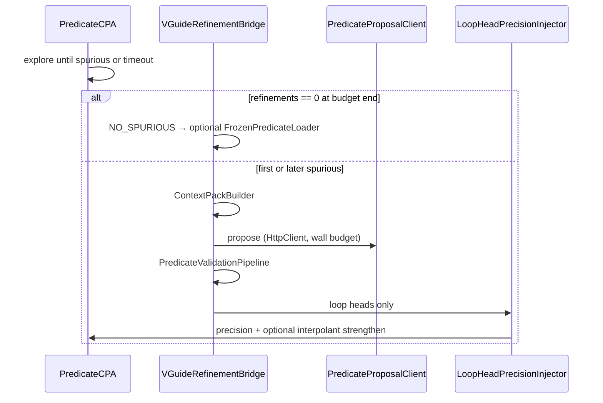

# Unified VGuide Architecture（單一路徑）

> 取代 B2 / B4 / B5 / Python sidecar / Record-Replay。Legacy 見本機 `archive/vguided-legacy/`（gitignore）。

## 決策摘要

| 項目 | 決定 |
|------|------|
| LLM | **全 Java `HttpClient`**（與 CPAchecker 同 JVM） |
| 觸發 | **第一條 spurious**（之前不呼叫 LLM） |
| 注入 | **僅 loop head**，`addLocalPredicates`（LBE 對齊） |
| ENTAILED | **允許** strengthen interpolant；否則只 precision |
| NO_SPURIOUS | **Exception**：可選 [FROZEN_PREDICATES](../evaluation/FROZEN_PREDICATES.md) |
| Replay | **Frozen predicate 檔**，不用 hash cache |
| Legacy B2/B4/B5 | **已歸檔** |

## 模組（Java package）

```
org.sosy_lab.cpachecker.cpa.predicate.vguide
  VGuideRefinementBridge      // 唯一入口，掛在 PredicateCPARefiner
  ContextPackBuilder          // source + CE + loop_heads + var_contract
  PredicateProposalClient     // DeepSeek HttpClient，可 parallel variants
  PredicateValidationPipeline // L1 contract, L2 parse, L3 SMT entailed
  LoopHeadPrecisionInjector   // local inject only
  FrozenPredicateLoader       // NO_SPURIOUS exception
  VGuideOutcome               // FIRST_SPURIOUS | FROZEN_SEED | NO_SPURIOUS_GIVE_UP
```

## 控制流



## 設定（`config/vguide.properties` 規劃）

```properties
vguide.enable=true
vguide.llm.model=deepseek-v4-pro
vguide.llm.effort=low
vguide.llm.variants=1
vguide.llm.wall_budget_sec=60
vguide.llm.per_call_timeout_sec=90
vguide.inject.loop_heads_only=true
vguide.inject.allow_interpolant_strengthen=true
vguide.exception.frozen_dir=docs/vguided-cegar/predicate_sets
```

`cpa.predicate.refinement.useVocabularyGuide=true` 改為只啟用 **Bridge**，**不**啟動舊 `LLMConnector.initializeVocabBlocking()`。

## 廢除項

- Python `bootstrap_*` / `b5_*` / `b4_*` 腳本（已歸檔）  
- `VGUIDE_INJECT_REPAIR_*` env 樹  
- `VGUIDE_LLM_RECORD` / `REPLAY`  
- Java `LLMConnector` 背景 thread（實作移除前以 `vguide.legacyConnector=false` 關閉）

## 實施順序

1. **文檔 + 歸檔**（本 commit）  
2. `PredicateProposalClient` + prompt 模板（合併原 bootstrap/B5 語意）  
3. `VGuideRefinementBridge` 接 Refiner；關舊 Connector 啟動  
4. `LoopHeadPrecisionInjector` + validation pipeline  
5. `FrozenPredicateLoader` + NO_SPURIOUS 統計日誌  
6. 刪除 archive 依賴的 demo 腳本，改 CPA 單命令 demo  

## 相關

- [FROZEN_PREDICATES.md](../evaluation/FROZEN_PREDICATES.md)  
- [LOCAL_DEVELOPMENT_ENV.md](../LOCAL_DEVELOPMENT_ENV.md)
