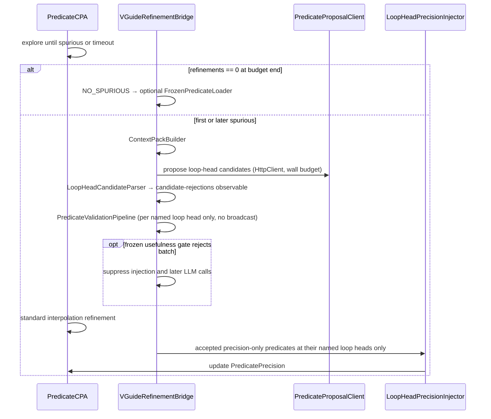

# Unified VGuide Architecture（單一路徑）

> 取代 B2 / B4 / B5 / Python sidecar。Legacy 見本機 `archive/vguided-legacy/`（gitignore）。

## 決策摘要

| 項目 | 決定 |
|------|------|
| LLM | **全 Java `HttpClient`**（與 CPAchecker 同 JVM） |
| 觸發 | runtime config決定；pinned stock-first為refinement #10、15秒或peel trigger |
| 注入 | **僅 loop head**，`addLocalPredicates`（LBE 對齊） |
| ENTAILED | L3-on 時：`block ⊨ pred` → strengthen interpolant（**主線不用 L3**） |
| L3 (SMT entailment) | **不用**（2026-06-07 消融：L3-on 整體較差 → `enableL3Entailment=false`） |
| NO_SPURIOUS | **Exception**：可選 [FROZEN_PREDICATES](../evaluation/FROZEN_PREDICATES.md) |
| Semantic seed replay | **Frozen predicate 檔**（NO_SPURIOUS exception） |
| Paired API replay | evaluation-only exact request-hash/ordinal response cache；fail closed |
| Legacy B2/B4/B5 | **已歸檔** |

## 模組（Java package）

```
org.sosy_lab.cpachecker.cpa.predicate.vguide
  VGuideRefinementBridge      // 唯一入口，掛在 PredicateCPARefiner
  ContextPackBuilder          // source + CE + loop_heads + var_contract
  StructuredCounterexampleBuilder // versioned deterministic CE prompt artifact
  LoopHeadCandidateParser     // loop-head-candidate-v1 契約：location 必填、rejections 可觀察
  PredicateProposalClient     // DeepSeek HttpClient，可 parallel variants
  LlmResponseCache            // paired record/replay；per-task namespace，無live fallback
  PredicateValidationPipeline // L1 contract, L2 parse, scope check, L3 per named loop head (L3 預設 off)
  LoopHeadPrecisionInjector   // local inject only
  FrozenPredicateLoader       // NO_SPURIOUS exception
  VGuideAnalysisDumper        // schema-5：validated diagnostics + candidate_rejections
  VGuideOutcome               // FIRST_SPURIOUS | FROZEN_SEED | NO_SPURIOUS_GIVE_UP
```

## 控制流


```mermaid
sequenceDiagram
  participant CPA as PredicateCPA
  participant Br as VGuideRefinementBridge
  participant LLM as PredicateProposalClient
  participant Inj as LoopHeadPrecisionInjector

  CPA->>CPA: explore until spurious or timeout
  alt refinements == 0 at budget end
    Br->>Br: NO_SPURIOUS → optional FrozenPredicateLoader
  else first or later spurious
    Br->>Br: ContextPackBuilder
    Br->>LLM: propose loop-head candidates (HttpClient, wall budget)
    Br->>Br: LoopHeadCandidateParser → candidate-rejections observable
    Br->>Br: PredicateValidationPipeline (per named loop head only, no broadcast)
    opt frozen usefulness gate rejects batch
      Br->>Br: suppress injection and later LLM calls
    end
    CPA->>CPA: standard interpolation refinement
    Br->>Inj: accepted precision-only predicates at their named loop heads only
    Inj->>CPA: update PredicatePrecision
  end
```

## Candidate contract（loop-head-candidate-v1）

LLM 輸出必須是 location-explicit 的 per-loop-head candidates（Issue #4）：

```json
{"schema_version":"loop-head-candidate-v1","candidates":[
  {"loop_head":"N19","predicate":"(bvsge i (_ bv0 32))","role":"bound"},
  {"loop_heads":["N19","N23"],"predicate":"(bvslt i k)","role":"relational"}
]}
```

- **無隱式 broadcast**：候選只在其自指的 loop heads 驗證與注入；無 location 的候選
  一律 reject（`missing_loop_head`）且原因可觀察。
- **Scope 驗證**：每個 free variable 必須在 encoded trace vocabulary 內，且
  function-qualified 名稱的 function 必須等於 head 的 function；違反 →
  `variable_not_in_scope`（per head，不 block 同候選其他 heads）。
- **Diagnostics（advisory，不影響 soundness）**：`over_specific`（變數不在 head
  block formula；不需 solver）；`group_conflict`（與同 head 已驗證集合矛盾；
  僅 `enableL3Entailment=true` 時計算，且不污染累積集合）。
- role（initiation/supporting/relational/bound）與 variables 是 metadata；
  initiation 先於 supporting 驗證。
- 詳細契約與 failure reasons 見 `LOOP_HEAD_INVARIANT_PLAN.md` §2–§8；
  dump schema-5 見 `analysis/PREDICATE_ANALYSIS_PLAN.md` §4.4–4.5。

## 主要設定（`config/vguide.properties`）

```properties
vguide.enable=true
vguide.llmCallSchedule=every_n_or_interval
vguide.llmEveryNSpuriousRefinements=10
vguide.llmMinIntervalSec=15
vguide.maxLlmRoundsPerAnalysis=5
vguide.peelLoopHeadThreshold=4
vguide.dualPromptMode=true
vguide.llmSamplesPerCall=1
vguide.enablePredicateUsefulnessGate=false
vguide.enableL3Entailment=false   # not used (ablation worse)
vguide.frozenDir=docs/vguided-cegar/predicate_sets
```

`cpa.predicate.refinement.useVocabularyGuide=true` 改為只啟用 **Bridge**，**不**啟動舊 `LLMConnector.initializeVocabBlocking()`。

## 廢除項

- Python `bootstrap_*` / `b5_*` / `b4_*` 腳本（已歸檔）  
- `VGUIDE_INJECT_REPAIR_*` env 樹  
- 舊版 `VGUIDE_LLM_RECORD` / `REPLAY` protocol（現行evaluation cache使用明確的
  `VGUIDE_LLM_{RECORD,REPLAY}_DIR`，不恢復legacy sidecar）
- Java `LLMConnector` 背景 thread（實作移除前以 `vguide.legacyConnector=false` 關閉）

## 已完成的實施順序

1. **文檔 + 歸檔**
2. `PredicateProposalClient` + prompt 模板（合併原 bootstrap/B5 語意）  
3. `VGuideRefinementBridge` 接 Refiner；關舊 Connector 啟動  
4. `LoopHeadPrecisionInjector` + validation pipeline  
5. `FrozenPredicateLoader` + NO_SPURIOUS 統計日誌  
6. 刪除 archive 依賴的 demo 腳本，改 CPA 單命令 demo  

## 相關

- [FROZEN_PREDICATES.md](../evaluation/FROZEN_PREDICATES.md)  
- [LOCAL_DEVELOPMENT_ENV.md](../LOCAL_DEVELOPMENT_ENV.md)
