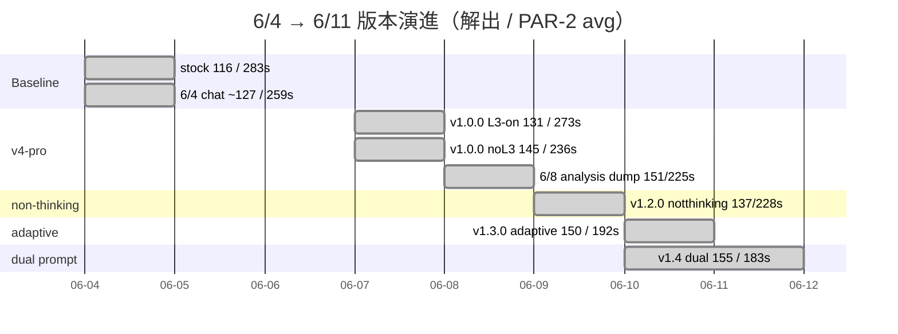
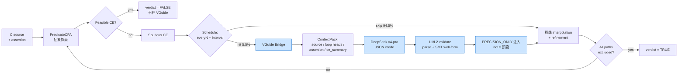
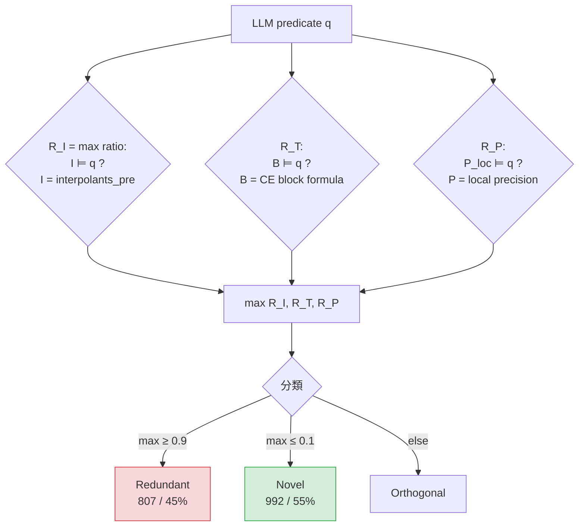
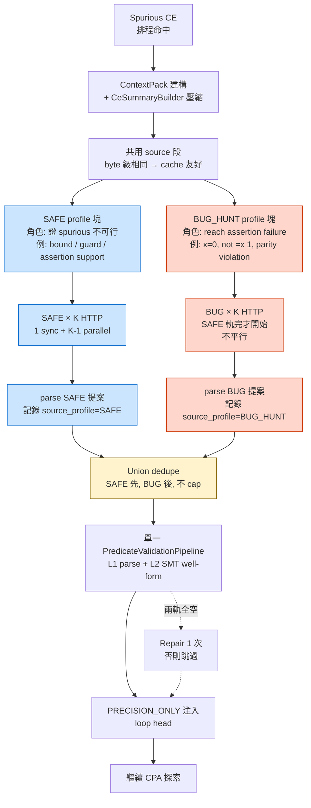

# VGuide 進度報告（2026-06-11，advisor meeting）

> 涵蓋 **2026-06-04 → 2026-06-11**（上次 advisor meeting 後 8 天）的所有實驗、機制分析、工程改動與計劃。
>
> **報告人**：r14k41044 黃思維 ｜ **專案**：CPAchecker Unified VGuide（LLM 引導 Predicate CEGAR）
> **Model**：`deepseek-v4-pro`（取代 6/4 報告用的 `deepseek-chat`）
> **Benchmark**：`full_scalar` 217 題（ReachSafety scalar 子集）
> **Timelimit**：300s（runner 外層 330s）
> **Baseline**：`full_scalar_stock`（同 config，`useVocabularyGuide=false`）

---

## Perf 對照總表（217 題，timelimit 300s）

| Run | 日期 | TRUE | FALSE | UNK | **解出 (T+F)** | Δ vs stock | **PAR-2 avg** | Δ PAR-2 sum | LLM API | LLM latency med | Improved / Degraded |
|-----|------|------|-------|-----|----------------|------------|---------------|-------------|---------|-----------------|---------------------|
| **stock** | baseline | 76 | 40 | 101 | **116** | — | **283.36s** | — | 0 | — | — |
| 6/4 chat（HISTORICAL） | 6/4 | — | — | — | ~127 | +11 | **259s** | — | 0 (K=1) | — | 11 / 1 |
| v1.0.0 **L3-on** | 6/7 | 92 | 39 | 86 | **131** | **+15** | **272.79s** | −2,293s | 210 | 53.4s | 17 / 2 |
| v1.0.0 **noL3** | 6/7 | 106 | 39 | 72 | **145** | **+29** | **235.65s** | −10,353s | ~200 | ~54s | 30 / 1 |
| noL3 analysis rerun | 6/8 | 112 | 39 | 66 | **151** | +35 | **224.85s** | −12,696s | 200 | 52.8s | 33 / 2 |
| **v1.2.0 notthinking** | 6/9 | 97 | 40 | 80 | **137** | **+21** | **228.48s** | **−11,909s** | 234 | **2.4s** | 21 / **0** |
| budget306（thinking） | 6/10 | 107 | 39 | 71 | 146 | +30 | 257.68s | −5,573s | 200 | 87.9s | — |
| **v1.3.0 adaptive freq10/n24** | 6/10 | 110 | 40 | 67 | **150** | **+34** | **192.03s** | **−19,819s** | 307 | 3.0s | 35 / 1 |
| **v1.4 dual SAFE+BUG** | 6/10–11 | **117** | **38** | 62 | **155** | **+39** | **183.05s** | **−21,767s** | ~600 (≈2×) | ~3s | 42 / 3 |

**關鍵走勢**

- 解出 **+39** vs stock，PAR-2 avg **−100s** vs stock；v1.4 同時是「解最多」與「最快」。
- **Thinking off 是分水嶺**：latency 從 ~53s → ~3s，後續實驗才能堆 API 數量。
- **數量槓桿（v1.3）**：API 234 → 307、preds/call 4 → 6 → 解出 +13；PAR-2 進一步降 36s。
- **FALSE 始終卡在 38–40**：dual prompt 反而 −2；找 bug 還沒突破。
- **Degraded** 累積 ≤3，無系統性回退。

| 指標 | v1.0 L3-on | v1.0 noL3 | notthinking | adaptive | dual v1.4 |
|------|-----------|-----------|-------------|----------|-----------|
| Validated predicates | — | — | 1,340 | 3,636 | (未開 dump) |
| Z3 **Novel%**（predicate） | — | ~55% | ~58% | **~75%** | — |
| `response_parse_ok` | — | 200/200 | — | 304/307 (99.0%) | — |
| budget_tier 分布（low/med/high） | — | — | — | **210 / 97 / 0** | — |
| Rescued (stock UNK → solved) | 17 | 30 | 21 | 35 | **42** |
| Degraded (vs stock) | 2 | 1 | **0** | 1 | 3 |

---

## 0. 一頁摘要：8 天內發生了什麼

| 階段 | 日期 | Commit | 解出 (T+F) | PAR-2 avg | 主要新東西 |
|------|------|--------|------------|-----------|-----------|
| 6/4 advisor 報告 | 2026-06-04 | (historical) | **127/217** †（deepseek-chat） | 259s | 主實驗 11↑/205=/1↓；K=1 |
| v4-pro 全量重跑 | 2026-06-07 | `c911c7f3f3` (v1.0.0) | **131/217**（L3-on）／**145/217**（noL3） | 272.79 / 235.65 | 換 `deepseek-v4-pro`；L3 消融；noL3 訂為預設 |
| Predicate 機制分析 | 2026-06-08 | (analysis) | 151/217（analysis rerun） | — | API `usage` ground truth；**Z3 overlap 55% Novel / 45% Redundant**；rescued 33 題全有 LLM |
| Thinking off | 2026-06-09 | `d7021692f9` | **137/217** | **228.48** | 關 DeepSeek V4 reasoning；latency 53s → 2.4s；+21 vs stock，**0 degraded** |
| Adaptive budget + freq10/n24 | 2026-06-10 | `fd69f395fa` (v1.3.0) | **150/217** | **192.03** | 自適應 predicate budget tiers（4–8 / 6–12 / 8–16）；every_n 72→24；rounds 5→10 |
| Dual SAFE+BUG prompts + ce_summary（v1.4） | 2026-06-10 → 6/11 | `85706b4bf0` | **155/217** | **183.05** | 雙軌 prompt；語意 CE 摘要；JSON mode 永久；**FALSE 目標未達** |

† 6/4 stock baseline 為 116/217；改 K=1 對照 chat 模型再跑曾達 127/217 量級（見 HISTORICAL）。本表以「相對 stock 116/217」一致呈現。

**8 天淨改善（v1.4 vs stock）**

- 解出：**+39**（116 → 155）
- PAR-2 avg：**−100s**（283.36 → 183.05）
- 相對 6/7 v1.0.0 L3-on（131）：**+24** 題，PAR-2 **−90s**
- Rescued：**42 improved / 3 degraded**（noL3 + adaptive + dual 累積）

**仍未解決**

- **v1.4 FALSE 目標失敗**：FALSE 40 → 38（−2，0 新 FALSE）；BUG_HUNT 軌仍偏「證 safe」
- `const_1-2`（loop-acceleration，expected FALSE）：6/10 v1.3 跑出 UNKNOWN（481 refinement、10 輪 LLM 打滿、verdict 不變）
- 7 題 SMT hang（`sumt5/7/8/9`, `watermelon` 等）：MathSAT `allSat` / interpolation 卡住，runner 補 synthetic UNKNOWN

---

## 1. 上次 advisor meeting 後的時間軸



```
2026-06-04  [HISTORICAL]    deepseek-chat 217 題：11↑/205=/1↓
2026-06-05  feat            benchmarks: SV-COMP ReachSafety + loops-full sparse；recommended profile
2026-06-06  feat(vguide)    unified Java pipeline；換 deepseek-v4-pro；repo cleanup（141939b1）
2026-06-07  release         v1.0.0 — predicate analysis + Z3 overlap + reports（c911c7f3）
                            └─ noL3 vs stock 30↑/186=/1↓；L3-on vs stock 17↑/198=/2↓
2026-06-08  docs            Predicate 分析報告：context budget、Z3 overlap 55/45、PCS
2026-06-09  fix(vguide)     disable DeepSeek V4 thinking by default（d7021692）
2026-06-09  release v1.2.0  notthinking：137 solved，PAR-2 228，latency 53 → 2.4s
2026-06-10  feat(vguide)    adaptive predicate budget tiers + freq config（fd69f395）
2026-06-10  release v1.3.0  adaptive freq10/n24：150 solved，PAR-2 192（4405b92c / 801fe8c7）
2026-06-10  feat(vguide)    freq20/n12 config + const_1-2 case study（093b4f65）
2026-06-10  feat(vguide)    dual SAFE/BUG prompts + semantic ce_summary（85706b4b）
2026-06-11  docs            v1.4 dual prompt 實驗報告：155 solved，PAR-2 183；FALSE 失敗
```

### 1.1 系統架構：LLM 在 CEGAR 中的位置



**藍色塊** = VGuide 介入點。重點：
- LLM **只在 spurious CE 上**觸發，**到不了 feasible 路徑** → 這正是 v1.4 FALSE 失敗的結構性原因（§7.7 第 2 點）。
- 預設 **noL3 = `PRECISION_ONLY` 注入**；L3-on 才 strengthen interpolant（6 題 parity 仍依賴）。
- `Schedule` 在 v1.3 後改為 every_n=24 + maxRounds=10（v1.4 every_n=12 + rounds=20）。

---

## 2. 主對照表（217 題，timelimit 300s）

| Run | Tag / Commit | TRUE | FALSE | UNK | 解出 | PAR-2 sum | PAR-2 avg | vs stock |
|-----|--------------|------|-------|-----|------|-----------|-----------|----------|
| **stock** | baseline | 76 | 40 | 101 | 116 | 61,489 | **283.36** | — |
| 6/4 chat（HISTORICAL） | — | (~80) | (~40) | — | (~127) | — | 259 | 11↑/205=/1↓ |
| 6/7 v4-pro **L3-on** | `c911c7f3` | 92 | 39 | 86 | 131 | — | **272.79** | 17↑/198=/2↓ |
| 6/7 v4-pro **noL3**（v1.0.0） | `c911c7f3` | 106 | 39 | 72 | **145** | — | **235.65** | 30↑/186=/1↓ |
| 6/8 noL3 analysis rerun | analysis dump | 112 | 39 | 66 | **151** | 48,793 | 224.85 | (analysis run) |
| 6/9 **notthinking**（v1.2.0） | `d7021692` | 97 | 40 | 80 | **137** | 49,581 | **228.48** | 21↑/196=/**0↓** |
| 6/10 budget306（thinking on，存檔） | — | 107 | 39 | 71 | 146 | 55,916 | 257.68 | — |
| 6/10 **adaptive freq10/n24**（v1.3.0） | `fd69f395` | 110 | 40 | 67 | **150** | 41,671 | **192.03** | 35↑/181=/1↓ |
| 6/10–6/11 **dual v1.4** | `85706b4b` | **117** | **38** | 62 | **155** | — | **183.05** | 42↑/172=/3↓ |

**重點趨勢**

1. 6/7 v1.0.0 之後 **預設 noL3**（`vguide.enableL3Entailment=false`）；6 題 parity/invariant 仍依賴 L3-on，需 `--ablation l3` 開啟。
2. **PAR-2 一路向下**：283 → 235 → 228 → 192 → **183**。v1.4 已比 stock 快 **100s/題** average。
3. **rescued 大多為 UNKNOWN→TRUE**（noL3 30/30；adaptive 35/36；dual 42/42）。**找新 bug 仍是弱項**。
4. Degraded 永遠不超過 3 題；6/9 notthinking **零 degraded**（最保守的單一改動）。

---

## 3. v1.0.0（6/7）：L3 消融與第一份完整對照

### 3.1 L3-on vs noL3（同 v4-pro，全 217 題）

| 對照 | improved | same | degraded |
|------|----------|------|----------|
| noL3 vs L3-on | **21** | 189 | **7** |
| noL3 vs stock | 30 | 186 | 1 |
| L3-on vs stock | 17 | 198 | 2 |

Transition（L3-on → noL3）：INCOMPLETE→TRUE **20**、TRUE→INCOMPLETE **6**、INCOMPLETE→FALSE **1**（`benchmark40_polynomial`）。

### 3.2 L3-on 獨贏 6 題（關 L3 後變 UNKNOWN）

`bin-suffix-5`, `mod4`, `mono-crafted_1`, `mono-crafted_12`, `overflow_1-1`, `simple_1-2`

**機制**：這批多為 **parity / invariant** 題。L3 **ENTAILED → strengthenInterpolants** 把 loop 不變式直接灌進插值，少次 refinement 即可 TRUE；noL3 只靠 `PRECISION_ONLY` 注入，refinement 多、易 timeout。

### 3.3 noL3 獨贏 19 題（節錄）

`MADWiFi-encode_ie_ok`, `benchmark04/15/20/24_conjunctive`, `bhmr2007`, `cggmp2005_variant`, `count_up_down-1`, `down`, `hhk2008`, `in-de20`, `in-de32`, `loopv2`, `loopv3`, `mono-crafted_10`, `simple_3-2`, `sum01-2`, `sumt4`, `up`

→ **LLM predicate + 精度注入** 本身有用，**不一定需要 L3 strengthen**。

### 3.4 兩者皆 rescue stock（11 題）

`benchmark19_conjunctive`, `benchmark34_conjunctive`, `count_by_nondet`, `ddlm2013`, `even`, `gr2006`, `jm2006_variant`, `mono-crafted_11`, `odd`, `string_concat-noarr`, `sumt3`

### 3.5 LLM 用量（L3-on 主實驗）

| LLM rounds/題 | 題數 |
|---------------|------|
| 0 | 27 |
| 1 | 172 |
| 2 | 16 |
| 3 | 2 |

全批 **210** API call（`llmSamplesPerCall=1`），latency median **53.4s**（含 reasoning），max 289s。
17 題 improved vs stock：平均 **1.5** 次 LLM/題。

---

## 4. v1.1（6/8 analysis）：Predicate 機制深度分析

完成 **instrumentation + 217 題重跑** 蒐集 API `usage`、全量 `interpolants_pre` / `block_formulas`、per-spurious dump，並跑 **Phase D 離線分析**（Z3 overlap / PCS）。

### 4.1 軸 A — Context budget（200 API call）

| 指標 | 值 |
|------|-----|
| `prompt_tokens` | min 479，**median 677**，max 2365 |
| 總 `prompt_tokens` | 137,544 |
| 總 `completion_tokens` | 620,458（含 reasoning） |
| `reasoning_tokens` 合計 | **599,651**（佔 completion 97%） |
| `prompt_cache_hit_tokens` 合計 | 115,584 |
| Latency | median **54s**，max 321s |

→ **瓶頸在 API latency + completion（含 reasoning）**，不是 prompt 長度。Context 還有大量餘量。**這直接驅動 6/9 關 thinking 的決策**。

### 4.2 軸 B — Z3 overlap（1799 predicates，~6s 跑完）



**分量貢獻**：R_I yes 474、R_T yes 703、R_P yes 60（1739 條因 SSA 名不一致跳過 R_P）。
Z3 UNSAT 即蘊含；timeout 8s 視為 unknown（0.5 分）。


| Overlap | 數量 | % |
|---------|------|---|
| **Novel** | **992** | **55.1%** |
| **Redundant** | **807** | **44.9%** |

| 分量 yes 次數 | 數量 | 含義 |
|---------------|------|------|
| R_I（`I ⊨ q`） | 474 | 插值已邏輯蘊含 q |
| R_T（`B ⊨ q`） | 703 | CE block 已邏輯蘊含 q |
| R_P（`P_loc ⊨ q`） | 60 | precision 已蘊含 q（1739 條因 SSA 不一致跳過 R_P） |

**解讀**：「與已有資訊重疊」實務上 ≈ 插值或 block 已涵蓋；precision 層面多數因 SSA 不一致未檢。**LLM 半數提案 Novel，有實質補強空間**。

### 4.3 軸 C — LLM 排程稀疏

| `llm_skip_reason` | 次數 |
|-------------------|------|
| `schedule` | 3433 |
| `no_interpolants` | 7 |
| 實際 `llm_called` | **199 / 3639 = 5.5%** |

`everyN=72` + `maxLlmRoundsPerAnalysis=5` → 180 題僅 **第 1 次 spurious** 呼叫 LLM。
**這是 6/10 把 every_n 從 72 → 24、rounds 從 5 → 10 的依據**。

### 4.4 軸 D — vs Stock（analysis rerun，noL3）

| | 數量 |
|--|------|
| Stock UNKNOWN → 解出（T/F） | **33** |
| 解出 → Stock UNKNOWN（degraded） | **2** |
| Verdict 相同 | 173 |
| **Rescued 且曾有 LLM** | **33 / 33（100%）** |

→ 救起來的題 **百分百靠 LLM**，不是 noise。

### 4.5 LLM 生成品質（K=1）

| 指標 | 數值 |
|------|------|
| API calls | 200 |
| `response_parse_ok` | **200 / 200** |
| 同回應重複字串 | **0 / 200** |
| Spurious 輪有叫 LLM | 199 |
| 該輪 `validated_predicates ≥ 1` | **197 / 199（99%）** |
| `predicates_raw` / call | median **7** |

→ JSON 解析、validation 都不是瓶頸。

---

## 5. v1.2.0（6/9）：Disable DeepSeek V4 thinking

`d7021692`。`VGUIDE_LLM_THINKING=disabled` 為預設。

### 5.1 結果

| Run | API calls | latency median | reasoning_tokens | 解出 | PAR-2 avg |
|-----|-----------|----------------|------------------|------|-----------|
| old_analysis（thinking） | 200 | **52.8s** | median 2576（全 call 有） | 151 | 224.85 |
| budget306（thinking） | 200 | **87.9s** | median 5465（全有） | 146 | 257.68 |
| **notthinking** | **234** | **2.4s** | **0** | **137** | **228.48** |

### 5.2 與 stock / thinking 對照

- **vs stock**：+21（116→137），**0 degraded**，Δ PAR-2 sum **−11,909s**。
- **vs budget306（thinking）**：解出 −9，PAR-2 **−6,336s**（更好；unsolved 少、無 LLM 拖時間）。
- **vs old_analysis（thinking）**：解出 −14，PAR-2 +788s（接近）。

### 5.3 Predicate / Z3 overlap（Phase D）

| 指標 | v1.0.0 thinking | notthinking |
|------|-----------------|-------------|
| Tasks with LLM | ~200 | 190 |
| Validated predicates | ~1799 | **1340** |
| Novel / Redundant | 992 / 807（55/45） | 776 / 564（**58/42**） |
| Stock UNKNOWN → solved（dump） | 33 | 18 |

Overlap 比例與 v1.0.0 相近；**predicate 總量較少**（更快 call，但每 call 提案數較少）。**解題不如 thinking 多，但 PAR-2 與成本顯著下降**。

**結論：thinking off 為新預設**，但「數量槓桿」是下一步。

---

## 6. v1.3.0（6/10）：Adaptive predicate budget + 提高 LLM 頻率

`fd69f395`。同時調 **兩個** 維度（用 dump 事後消融）。

### 6.1 變更

| 參數 | v1.2.0 | **v1.3.0** |
|------|--------|------------|
| `llmEveryNSpuriousRefinements` | 72 | **24** |
| `llmMinIntervalSec` | 15 | 15 |
| `maxLlmRoundsPerAnalysis` | 5 | **10** |
| `enableAdaptivePredicateBudget` | false | **true** |
| `llmMaxCompletionTokens` | 1024 | **2048** |

### 6.2 自適應 budget tier

複雜度分數 `S`（每輪依當次 `ContextPack` 計算）：

| 因子 | 分數 |
|------|------|
| `loop_heads` 數 | +1/head（cap +3） |
| assertion 含 `bvand`/`bvurem`/巢狀 `bvadd` | +2 |
| 允許 scalar 變數 ≥5 / ≥8 | +1 / +2 |
| Source 含 array decl | +1 |
| `refinement_index > 1`（later spurious） | +1 |

| 檔位 | S | `(min, max)` | 典型題 |
|------|---|--------------|--------|
| **low** | ≤3 | (4, 8) | 單 loop、簡單 assert |
| **medium** | 4–6 | (6, 12) | 雙 loop、`down` |
| **high** | ≥7 | (8, 16) | `odd`、parity、多變數 |

### 6.3 結果

| Run | API calls | latency med | preds/call med | 解出 | PAR-2 avg |
|-----|-----------|-------------|----------------|------|-----------|
| old_analysis（thinking） | 226 | 47.9s | 8 | 151 | 224.85 |
| notthinking | 234 | 2.4s | 4 | 137 | 228.48 |
| **adaptive**（v1.3.0） | **307** | **3.0s** | **6** | **150** | **192.03** |

| 指標 | adaptive |
|------|----------|
| `response_parse_ok` | 304/307（**99.0%**） |
| budget_tier 分布 | **low 210**，**medium 97**，**high 0** |
| 檔位內 preds/call median | low 6.0；medium 9.0 |

### 6.4 vs stock / notthinking / old_analysis

| 對照 | Δ 解出 | Δ PAR-2 sum |
|------|--------|-------------|
| vs **stock** | **+34** | **−19,819s** |
| vs **notthinking** | **+13**（16 improved / 3 degraded） | **−7,910s** |
| vs **old_analysis**（thinking） | −1（15 improved / 16 degraded） | **−7,122s**（adaptive 更好） |

**notthinking 贏 adaptive 3 題**：`benchmark10/15/20_conjunctive`
**adaptive 贏 notthinking 16 題（節選）**：`bhmr2007`, `bin-suffix-5`, `functions_1-1`, `in-de42`, `linear-inequality-inv-a`, `loopv2`, `mono-crafted_1`, `nested3-1`, `nested9` …

### 6.5 Predicate / Z3 overlap

| | old_analysis | notthinking | **adaptive** |
|---|---|---|---|
| Validated predicates | ~1799 | 1340 | **3636** |
| Novel / Redundant | 992 / 807 | 776 / 564 | **2714 / 921** |
| Novel%（predicate 級） | ~55% | ~58% | **~75%** |
| pct_novel median（per task） | 50% | 50% | 50% |
| preds / task median | 8 | 5 | 6 |
| Stock UNKNOWN → solved（dump） | 33 | 18 | **31** |

Per-task median Novel% 仍 **~50%**；總 Novel 數上升主要來自 **更多 API call + 更高 preds/call**，非單題品質突變。

### 6.6 觀察與限制

- **High tier 未觸發**：複雜度分數 S 多落 low/medium；`odd` 僅 1 次 LLM、tier=low（5 preds）；`down` / `string_concat-noarr` 為 medium、median 8–10 preds **但仍 UNKNOWN**。
- **數量槓桿有效**：preds/call 4→6、call 234→307 → 解題 +13 vs notthinking，接近 old_analysis（−1）且 PAR-2 更好。
- **代價可控**：latency ~3s/call（無 thinking）；PAR-2 avg **192s** 為當時最佳。
- **唯一回退**：`benchmark10_conjunctive`（TRUE → UNKNOWN）。

---

## 7. v1.4（6/10–6/11）：Dual SAFE+BUG prompts + 語意 CE 摘要

`85706b4b`。為了試圖找 bug（FALSE 導向），加上一條 **BUG_HUNT** prompt 軌。

### 7.1 設計（[DUAL_PROMPT_V1_PLAN.md](../analysis/DUAL_PROMPT_V1_PLAN.md)）

| 項 | 決策 |
|----|------|
| Prompt 軌 | **SAFE × K + BUG × K** = 每輪 2K HTTP（K=1 → 2 HTTP/輪） |
| Source | 兩軌 byte 級相同（cache 友好） |
| Profile 差異 | 在 source **之後** 的 profile 塊；assertion 內容相同，標籤不同 |
| JSON mode | **永久** `json_object` |
| 合併 | SAFE ∪ BUG dedupe → **直接 union**，不 cap |
| Validation | 一套 pipeline；validated 行紀錄 `source_profile` |
| Repair | 任一軌 accepted → 不修；兩軌全空才 repair |
| `ce_summary` | **必做**（取代 `trace_summary`，**語意壓縮**，見下） |
| `dualPromptMode` | **預設 true** |

### 7.2 CE summary 語意壓縮（[CE_SUMMARY_COMPRESSION.md](../analysis/CE_SUMMARY_COMPRESSION.md)）

原 `trace_summary` = 前 5 block 整段 `dumpFormula` → median **2772** chars / max **8914** chars。內含 `declare-fun`, `.def_*`, SSA `@3` —— 對 LLM **冗餘且名字錯誤**。

新管線：

```
BlockFormulas + trace + loop heads
  → (A) 只選 loop-head blocks（≤4 heads）
  → (B) SMT → source 名關係式（VarContractBuilder.sourceNameFromEncoded）
  → (C) 跨 head 去重 / delta（i: 0→1）
  → (D) 含 assertion 變量者優先
  → (E) 格式化（text 或 JSON）
```

預估 median **<600 chars**（vs 現 2772）；字元 fallback **>12000** 才觸發（vs 現 max 8914 → 正常不觸發）。

### 7.3 單輪流程（每次 scheduled spurious 觸發）



**關鍵不對稱**：兩軌共用 source（cache 友好）、共用 validate / inject pipeline；profile 差異只在 source **之後** 的小塊文字 + assertion 標籤。這也是 §7.7 第 3 點「合併仍偏向證安全」的成因——validate 把 invariant 類提案放優先位，BUG 軌的 violation 狀態謂詞容易被視為冗餘。

### 7.4 v1.4 配置（`config/vguide-experiment-dual-prompt-v1.properties`）

```properties
include vguide-experiment-freq20-n12.properties  # every_n=12, maxRounds=20, adaptive
vguide.dualPromptMode=true
vguide.llmSamplesPerCall=1
```

### 7.5 結果（`full_scalar_dual_v1_20260610`，217 題）

| Run | TRUE | FALSE | UNK | 解出 | PAR-2 avg |
|-----|------|-------|-----|------|-----------|
| stock | 76 | 40 | 101 | 116 | 283.36 |
| v1.3 adaptive | 110 | 40 | 67 | 150 | 192.03 |
| **v1.4 dual** | **117** | **38** | 62 | **155** | **183.05** |

**vs stock**：+39 solved，improved 42 / same 172 / degraded 3，Δ PAR-2 sum **−21,767s**。
**vs v1.3 adaptive**：+5 solved，improved 10 / same 202 / degraded 5，Δ PAR-2 sum **−1,948s**。

### 7.6 v1.4 主目標 — **FALSE 驗收失敗**

| 驗收項（DUAL_PROMPT_V1_PLAN §6） | 目標 | 結果 |
|----------------------------------|------|------|
| FALSE +≥2 vs 基線 | ≥42 | **38（−2）** |
| 新 FALSE（baseline 非 FALSE → dual FALSE） | ≥2 | **0** |
| 丟失 FALSE | 0 | **2**（`benchmark40_polynomial`, `benchmark53_polynomial`） |
| `regression_false_unknown` smoke | 子集 | **未跑** |
| `const_1-2` | 進度 | **未單獨跑** |
| analysis dump（`source_profile`） | 開 | **未開**（本 run） |

### 7.7 FALSE 失敗的歸因（**重點**）

1. **評測集合不對焦**：`full_scalar` 217 題中 stock 已 FALSE 40 題。BUG_HUNT 在同集合上的天花板是「維持或替換」既有 FALSE，而非大量新增。**計劃中的 `regression_false_unknown` 子集（~25 題 stock UNKNOWN + expected FALSE）未跑**。
2. **LLM 只在 spurious CE 上觸發**：Spurious 路徑定義上**到不了**真實 assertion failure；`ce_summary` 摘要的是 spurious 上的 loop 關係，與「通向 FALSE 的路徑」**語意不一致**。BUG 軌要求 failure 狀態謂詞，但上下文仍是 **safe-abstraction 分裂** 的證據。
3. **SAFE ∪ BUG 合併仍偏「證安全」**：兩軌共用同一 validation/inject。Invariant、bound 類謂詞更容易通過 L1，BUG 軌提議的 negation / violation 狀態謂詞常被視為冗餘或被 SAFE 軌「先佔」位。
4. **`ce_summary` 不標 violation 路徑**：語意壓縮（loop-head rel + interpolant）省略了「哪條路徑能觸發 assert」；僅有變量關係，BUG 軌缺少可操作的 failure witness。
5. **無 FALSE 專用排程**：未對 feasible CE、長時間 UNKNOWN、yml `expected_verdict: false` 題加權呼叫 LLM。
6. **本 run 無 analysis dump**：無法統計 `source_profile=BUG_HUNT` 注入占比；log 層亦未印 per-profile API 行。

---

## 8. Case study：`const_1-2`（loop-acceleration，expected FALSE）

```c
unsigned int x = 1, y = 0;
while (y < 1024) { x = 0; y++; }
__VERIFIER_assert(x == 1);   // 跑完 x=0 → 必失敗
```

### 8.1 v1.3.0 結果（freq10/n24, adaptive）

| 指標 | adaptive | stock | old_analysis |
|------|----------|-------|--------------|
| Verdict | **UNKNOWN**（應 **FALSE**） | UNKNOWN | UNKNOWN |
| Predicate refinements | **481** | 138 | 73 |
| Wall | 312.2s | — | — |
| LLM rounds / API | **10 / 10**（打滿） | 0 | — |

### 8.2 為何「高 refinement + 打滿 LLM」仍 UNKNOWN

- **481** 次 predicate refinement：絕大多數時間在 SMT 插值 / 精度更新，不是 LLM。
- LLM 10 次全用盡（`maxLlmRounds=10`）；排程觸發點 spurious **#1, #49, #97, … #433**（間隔 48；#25 等被 15s interval 跳過）。
- 最後一輪 LLM 在 #433；之後仍有 spurious 至 #481 但已無 LLM 配額。
- Budget tier **全程 low**（S 低）；preds/call 固定 6，parse_ok 10/10，validated/injected 60/60。
- **模型穩定輸出 6 條，但未產關鍵謂詞**：例如 `y` 與 1024 的關係、`x` 在 loop 出口語意。**first prompt 無 CE 摘要**。

### 8.3 SV-COMP 對照

ReachSafety-Loops / loop-acceleration 標準題。SV-COMP 2024 中 **~40+ 工具 `false(unreach-call)`**（CPAchecker SV-COMP'24 也是 `false`）。**這題不是「沒人解出」**——多數競賽工具都能在時限內找出 bug。

**我們 predicate+VGuide 跑成 UNKNOWN** 代表 **沒找到反例也沒證 safe**，比賽意義上未解出。

### 8.4 v1.4 dual 對 `const_1-2` 沒有單跑 → **未驗證**

---

## 9. 工程與 infra 改動（commit 索引）

| Commit | 主題 |
|--------|------|
| `daf6e7d0` | SV-COMP ReachSafety + loops-full sparse 下載 |
| `14378c17` | benchmarks recommended profile（ReachSafety + P1） |
| `141939b1` | unified Java pipeline + v4-pro + repo cleanup |
| `c911c7f3` | **v1.0.0** release（predicate analysis + Z3 overlap + reports） |
| `801fe8c7` | configurable single-draw predicate budget (min/max) |
| `4405b92c` | reliable batch summary CSV + log rebuild helper |
| `d7021692` | **v1.2.0** disable DeepSeek V4 thinking by default |
| `fd69f395` | **v1.3.0** adaptive predicate budget tiers + freq config |
| `093b4f65` | freq20/n12 experiment config + const_1-2 case study |
| `85706b4b` | **v1.4** dual SAFE/BUG prompts + semantic `ce_summary` + JSON mode |

**新 / 改動的核心檔案**

- `src/.../cpa/predicate/vguide/PredicateBudgetResolver.java`（v1.3 adaptive tier）
- `src/.../cpa/predicate/vguide/CeSummaryBuilder.java`（v1.4 語意壓縮）
- `src/.../cpa/predicate/vguide/ProposalPromptBuilder.java`（v1.4 雙 profile + 永久 JSON mode）
- `src/.../cpa/predicate/vguide/PredicateProposalClient.java`（JSON mode 永久）
- `src/.../cpa/predicate/vguide/VGuideRefinementBridge.java`（雙軌排程 + repair 規則）
- `config/vguide-experiment-freq10-n24.properties`（v1.3 主線）
- `config/vguide-experiment-freq20-n12.properties`（freq2x）
- `config/vguide-experiment-dual-prompt-v1.properties`（v1.4 主線）

**分析腳本**

- `scripts/vguided-cegar/analyze_predicate_study.py`（+ Z3 overlap、`pcs_per_predicate.csv`、`overlap_summary.csv`）
- `scripts/vguided-cegar/z3_overlap.py`（z3-solver；全量 1799 ~6s）
- `scripts/vguided-cegar/post_batch_analysis.sh`（一鍵 PAR-2 / cactus / vs_stock）

---

## 10. 已知問題（自 6/4 起未解）

### 10.1 SMT hang（7 題 L3-on 仍 UNKNOWN）

`bhmr2007`, `sumt4`, `sumt5`, `sumt7`, `sumt8`, `sumt9`, `watermelon`

300s 到期時卡在 MathSAT `allSat` / interpolation；JVM 強殺來不及印 verdict。Runner `finalize_log_verdict` 事後補 synthetic `UNKNOWN`（語意不變）。**多數 stock 亦會 hang**。`watermelon` 另因 SMT 變數名 `false` 觸發 Java exception。

**6/7 重跑**（`incomplete_l3on_rerun.list`，8 題 L3-on）：`benchmark53_polynomial` 改 **FALSE**（45.8s）；其餘 7 題仍 UNKNOWN。初跑 hang 可能受 LLM predicate 路徑影響，**非穩定 regression**。

### 10.2 同 verdict 速度（vs stock）

L3-on 同解 verdict：vguide 較快 **11** 題，stock 較快 **103** 題；同 verdict 牆鐘 median 約 **stock 的 30–33×**。
**v1.4 同 verdict 牆鐘 median ~3–4× stock**（已大幅改善但仍慢）。

### 10.3 高 refinement 題未終結

`const_1-2`、`down`、`string_concat-noarr` 類：preds/call 6–10、parse_ok 99%+，**但仍 UNKNOWN**。LLM 介入有效但 **「方向不對」**——v1.4 dual 嘗試解此問題但 FALSE 失敗。

---

## 11. 下一步（v1.5 草案，已修正）

> **2026-06-11 更新：** v1.5 先不往 FALSE / bug-finding context 工程探索；該方向移到 TODO / v1.6+。v1.5 改以 **官方 SV-COMP Loops exploratory evaluation** 為主：建立 500+/700+ 題 set、加入 `--svcomp26` strong baseline、用 tier/tag 分析 VGuide 有效範圍。完整計劃見 [`analysis/V1_5_LOOPS_EXPLORATORY_PLAN.md`](../analysis/V1_5_LOOPS_EXPLORATORY_PLAN.md)。

優先序：

### 11.1 建立官方 Loops large set（最緊急）

- 從官方 `c/Loops.set` 展開 task。
- 以 yml **property entry** 為單位，抽 `unreach-call.prp`。
- 產生：
  - `loops_reachsafety_unreach`：約 **764** entries（broad main set）
  - `loops_reachsafety_clean`：約 **517** entries（500+ clean VGuide-friendly set）
  - `loops_reachsafety_applicable`：約 **466** entries（mechanism subset）

### 11.2 Classifier 改成 tier/tag stratifier

- 不再把非 scalar 題直接當 skip。
- 原 `RUN_SCALAR` → `CORE_SCALAR`。
- 原 `RUN_ARRAY_SCALAR` → `CORE_ARRAY_SCALAR`。
- array-select / parser-risk / pointer / float / concurrency 先標籤化，跑完按 tier 解釋。

### 11.3 新增 strong baseline `--svcomp26`

- 保留 `--mode stock` 作同 PredicateCPA 管線對照。
- 新增 `--mode svcomp26` 作 CPAchecker strong portfolio baseline。
- 報告不要求 VGuide 贏 `--svcomp26` overall；重點是 VGuide-only solved、互補性、以及 svcomp26-only 題的 tier 分布。

### 11.4 CSV manifest 與 property-aware runner

- 新 manifest 欄位：`task_id,yml,input_file,property_file,expected_verdict,tier,tags`。
- Runner / analysis 要能 join metadata，輸出 tier transition table。

### 11.5 實驗順序

1. Dataset generation only。
2. 30 題 smoke：stock / VGuide / svcomp26。
3. `loops_reachsafety_clean` 517 題 full run。
4. `loops_reachsafety_unreach` 764 題 full run。
5. 視結果跑 array-select / parser-risk / expected-false / true-rescue side sets。

### 11.6 FALSE 導向移 TODO

- 不跑 `regression_false_unknown` 作 v1.5 主驗收。
- 不實作 doomed-region / suffix-WP / BUG-only context。
- `expected_false` subset 僅作分層統計；FALSE improvement 留 v1.6+ 重新設計。

---

## 12. 產物索引

### 12.1 報告

| 檔案 | 主題 |
|------|------|
| `reports/2026-06-07_vguide-report_deepseek-v4-pro.md` | v1.0.0 主對照 / L3 消融 |
| `reports/2026-06-08_predicate-analysis_noL3.md` | Predicate 機制（context / Z3 / 排程） |
| `reports/2026-06-09_notthinking_noL3.md` | Thinking off |
| `reports/2026-06-10_freq10_n24_adaptive_noL3.md` | **v1.3.0** adaptive |
| `reports/2026-06-10_dual_prompt_v1_noL3.md` | **v1.4** dual prompt（FALSE 失敗） |
| `reports/2026-06-11_advisor_meeting_post_0604.md` | **本檔** |
| `archive/vguided-docs/reports/2026-06-04_vguide-report_deepseek-chat_HISTORICAL.md` | 上次 advisor 快照 |

### 12.2 設計文件

| 檔案 | 主題 |
|------|------|
| `analysis/PREDICATE_ANALYSIS_PLAN.md` | Phase D（Z3 overlap）方法 |
| `analysis/OVERLAP_AND_PCS.md` | Overlap 定義與 PCS |
| `analysis/V1_5_LOOPS_EXPLORATORY_PLAN.md` | v1.5 Loops exploratory evaluation（FALSE 移 TODO） |
| `analysis/FALSE_ORIENTED_VGUIDE_PLAN.md` | BUG 導向 prompt / harness 早期設計（v1.6+ TODO） |
| `analysis/DUAL_PROMPT_V1_PLAN.md` | v1.4 雙軌設計 |
| `analysis/CE_SUMMARY_COMPRESSION.md` | 語意 CE 壓縮 |
| `analysis/CE_CONTEXT_PROMPT_PLAN.md` | CE context prompt（合併入 v1.4 Phase 1） |
| `analysis/case_studies/const_1-2.md` | Case study |

### 12.3 實驗目錄

| Run | 路徑 |
|-----|------|
| Stock | `output/vguide/experiments/full_scalar_stock/` |
| L3-on | `output/vguide/experiments/full_scalar_vguide/` |
| noL3 v1.0.0 | `output/vguide/experiments/full_scalar_vguide_noL3/` |
| noL3 analysis dump（6/8） | `output/vguide/analysis_dumps/full_scalar_noL3_20260608/` |
| notthinking | `output/vguide/experiments/full_scalar_vguide_noL3_notthinking_20260609/` |
| **adaptive freq10/n24** | `output/vguide/experiments/full_scalar_vguide_noL3_freq10_n24_adaptive_20260610/` |
| adaptive dump | `output/vguide/analysis_dumps/full_scalar_noL3_freq10_n24_adaptive_20260610/` |
| **dual v1.4** | `output/vguide/experiments/full_scalar_dual_v1_20260610/` |
| 三向 CSV | `output/vguide/experiments/l3_ablation_comparison.csv` |

### 12.4 一鍵重跑分析

```bash
# vs stock 對照 + cactus
./scripts/vguided-cegar/post_batch_analysis.sh \
  --vguide-out output/vguide/experiments/full_scalar_dual_v1_20260610 \
  --stock-out  output/vguide/experiments/full_scalar_stock \
  --set full_scalar --timelimit 300

# Phase D（Z3 overlap）
python3 scripts/vguided-cegar/analyze_predicate_study.py \
  --dump-dir output/vguide/analysis_dumps/full_scalar_noL3_freq10_n24_adaptive_20260610 \
  --logs-dir output/vguide/experiments/full_scalar_vguide_noL3_freq10_n24_adaptive_20260610/logs \
  --stock-logs output/vguide/experiments/full_scalar_stock/logs \
  --out output/vguide/analysis_dumps/full_scalar_noL3_freq10_n24_adaptive_20260610/analysis
```

---

## 13. 一句總結

8 天內：解出從 **116 → 155**（+39，PAR-2 −100s），靠 **noL3 預設 + thinking off + adaptive budget + dual prompt** 四步累積；機制側建立了 **Z3 overlap / context budget / 排程占比** 三軸量化。**FALSE 目標仍未達**，但 v1.5 先不追 FALSE；下週改聚焦官方 SV-COMP Loops 500+/700+ exploratory evaluation、tier 分析與 `--svcomp26` strong baseline。
